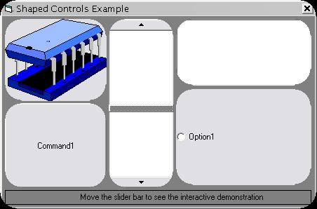



## Dynamically Shaped \(round\) Controls and Forms

### Description

This code demonstrates using the windows api to create and combine regions. The end result is a cool quick routine to shape buttons, forms, listboxes - anything with a hWnd. This code can be easily modified to create objects of any shape, the round controls in the example are just one implementation.
 
### More Info
 
A control

May cause a memory leak if you arnt careful with it.

             |
---                |---
**Submitted On**   |2002-12-05 17:00:12
**By**             |[Jeffrey Katz](https://github.com/Planet-Source-Code/PSCIndex/blob/master/ByAuthor/jeffrey-katz.md)
**Level**          |Intermediate
**User Rating**    |5.0 (30 globes from 6 users)
**Compatibility**  |VB 4\.0 \(32\-bit\), VB 5\.0, VB 6\.0
**Category**       |[Windows API Call/ Explanation](https://github.com/Planet-Source-Code/PSCIndex/blob/master/ByCategory/windows-api-call-explanation__1-39.md)
**World**          |[Visual Basic](https://github.com/Planet-Source-Code/PSCIndex/blob/master/ByWorld/visual-basic.md)
**Archive File**   |[Dynamicall1508511252002\.zip](https://github.com/Planet-Source-Code/jeffrey-katz-dynamically-shaped-round-controls-and-forms__1-41335/archive/master.zip)

